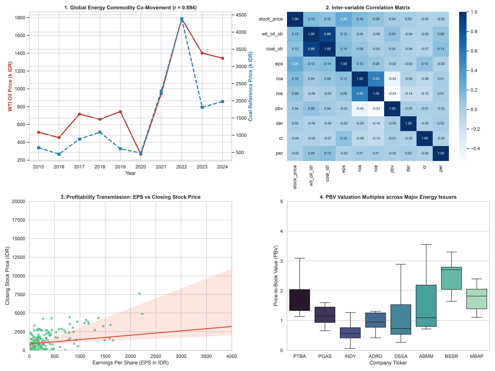

# Energy Commodity Transmission & Corporate Fundamental Valuation Analysis (2015-2024)


## Executive Dashboard


---

## Project Overview
Sebuah studi analitik empiris dan pemodelan ekonometrika data panel yang meneliti keterkaitan makroekonomi global antara **Harga Minyak Mentah WTI** dan **Batu Bara Acuan (HBA)**, serta mekanisme transmisinya terhadap rasio fundamental internal (**ROA, ROE, CR, PBV, EPS, DER, PER**) dan kinerja harga saham 29 emiten sektor energi di Bursa Efek Indonesia sepanjang periode 10 tahun (2015–2024, 290 observasi berimbang).

---

## Key Findings & Business Insights
* **Kointegrasi Kuat Komoditas Global ($r = 0.894$):** Minyak WTI dan Batu Bara Acuan menunjukkan korelasi positif searah yang sangat kuat dengan pergerakan siklus simultan (*supercycle peak* pada 2022).
* **Efektivitas Model Regresi Panel (Adjusted $R^2 = 80.04\%$):** Melalui estimasi *Fixed Effect Model (FEM)*, variasi harga saham sektor energi secara signifikan ditentukan oleh kombinasi faktor fundamental emiten dan tren harga komoditas global.
* **Transmisi Profitabilitas ke Nilai Pasar:** Variabel laba per lembar saham (**EPS**) dan rasio valuasi (**PBV**) menjadi pendorong linier paling konsisten terhadap pergerakan harga saham penutup emiten energi.
* **Struktur Modal vs Sentimen Laba:** Variasi rasio solvabilitas/likuiditas (**DER** dan **CR**) memiliki korelasi yang sangat rendah terhadap valuasi pasar saham, menegaskan bahwa pasar energi Indonesia lebih responsif terhadap dinamika arus kas operasional dan siklus laba komoditas.

---

## Repository Structure
```text
├── Data Fundamental Sektor Energi dan Komoditas.xlsx
├── energy_commodity_analytics_dashboard.png
├── scripts/
│   └── energy_analytics.py
├── sql/
│   └── energy_panel_queries.sql
└── README.md
